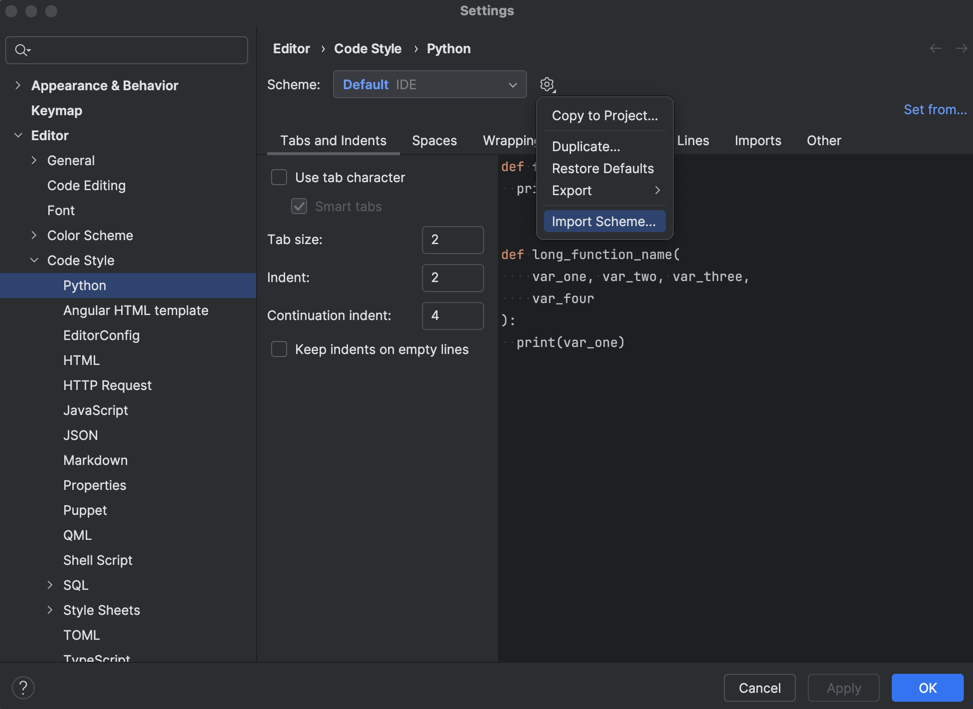

# EpiPINN

A Physics-Informed Neural Network approach for compartmental epidemiological
models.

Powered by the [DeepXDE](https://deepxde.readthedocs.io/en/stable/) library.

## Getting Started

The conda package manager is a prerequisite for this project. If you don't have
it installed, the [Miniforge](https://github.com/conda-forge/miniforge)
distribution is recommended.

To use conda environments:

```bash
conda env create -f environment.yaml
conda activate pinn
```

If the environment already exists and the `environment.yaml` file has been
updated, you can update the environment with:

```bash
conda env update -f environment.yaml --prune
```

If you changed the environment and want to update the `environment.yaml` file,
you can do so with:

```bash
conda env export --no-builds | grep -v "^prefix: " > environment.yaml
```

## For JetBrain IDEs

You can import the code style settings from the `docs/code_style.xml` file. To
do this, go to `File -> Settings -> Editor -> Code Style -> Python` and click on
the gear icon. Then, select `Import Scheme -> Intellij IDEA code style XML` and
select the file.



## TODO

- Find an activation function that constraints the output to be inside a range:
  e.g: beta needs to be positive and with an upper bound around 10 * 0.2 (r0 *
  delta)
- Create a twin model with variable constraints
- Apply test_train_split to the data
- Rescale population correctly, and using and activation, not a scaling constant